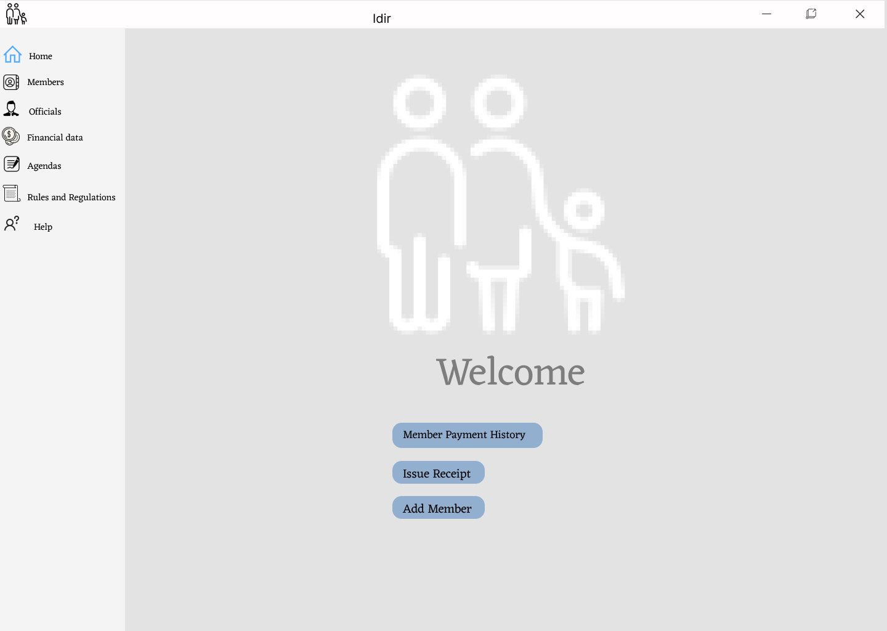
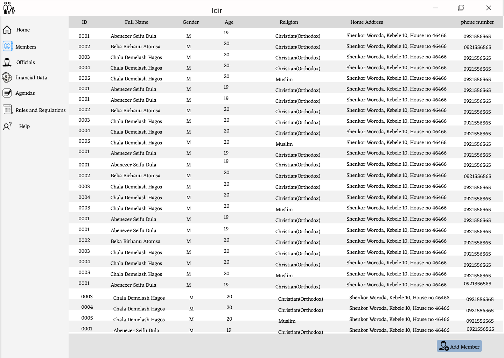
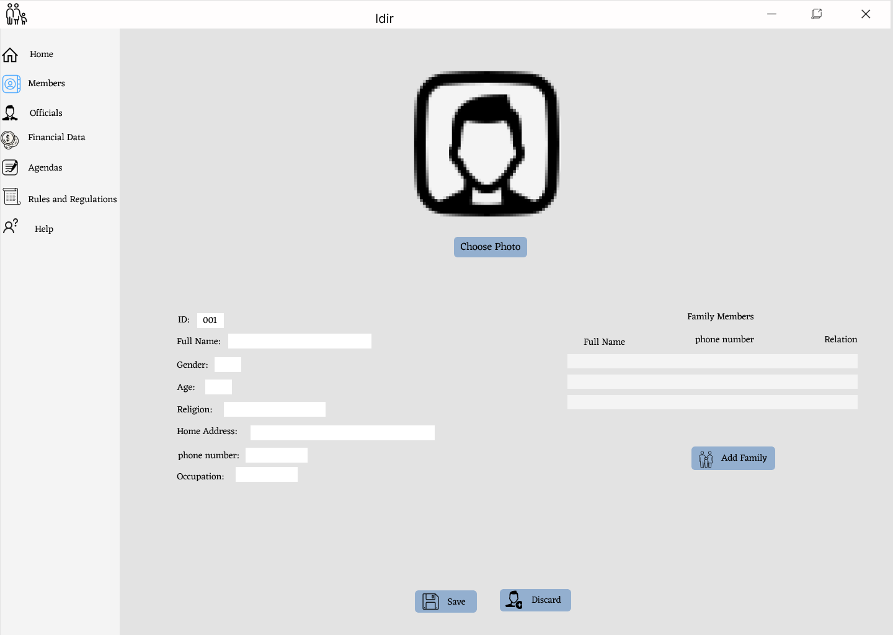
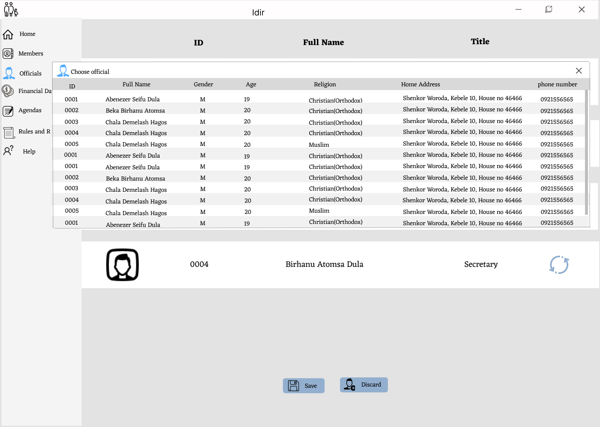
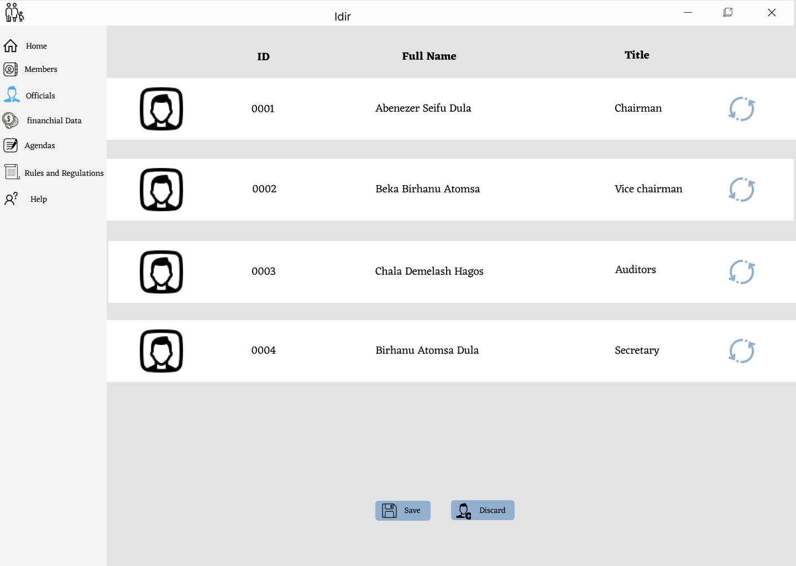
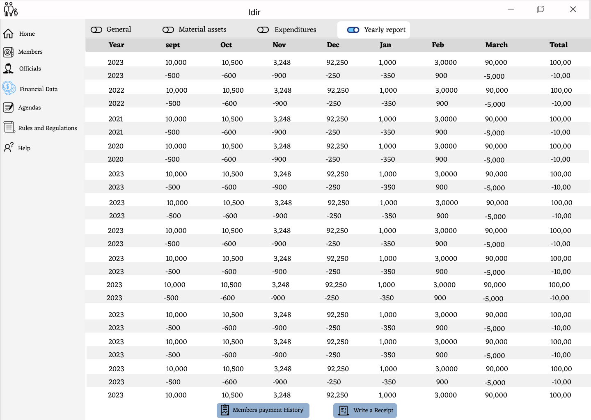
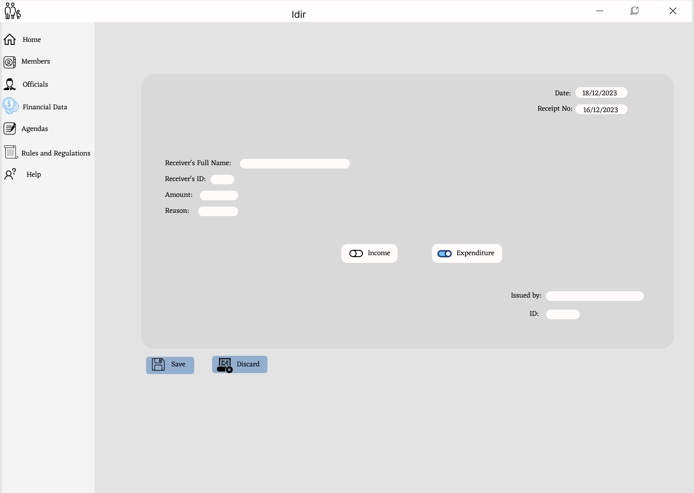
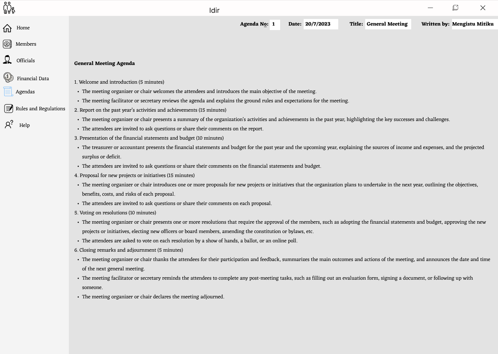
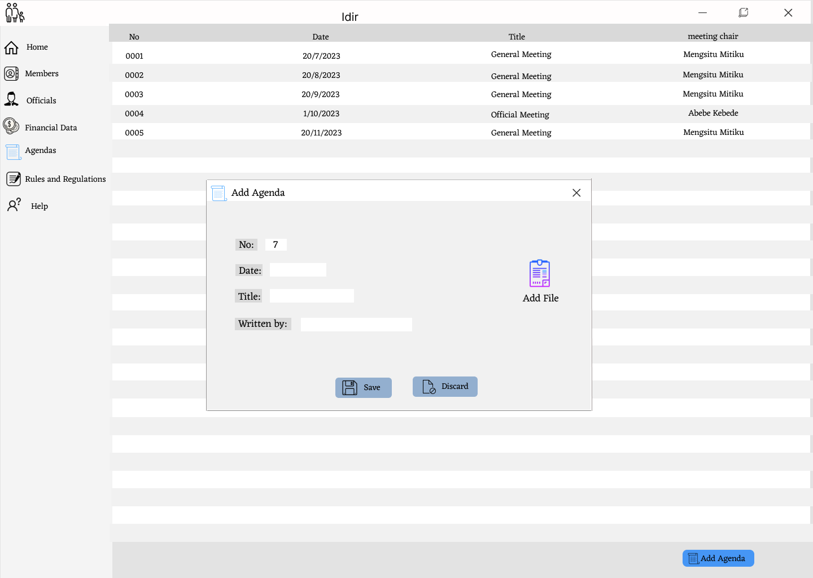

# IDIR Management App

IDIR is a traditional social system in Ethiopia where communities unite to provide mutual support during times of joy and sorrow. Members contribute funds on a monthly basis or as needed. This project aims to create a Java-based application with an SQL database to efficiently manage this social system.

## Goals

Our goal is to develop a user-friendly program that enhances access to the local IDIR system in Ethiopia. By moving away from traditional handwritten record-keeping, we aim to eliminate issues such as data duplication, unnecessary record books, and potential data loss. Our program addresses these problems with modern technology.

## Features

### Managing Members
- Add, edit, and remove members from the IDIR system.

### Managing Officials
- Promote and demote officials within the IDIR system.

### Financials
- Provide a general summary of total expenses, income, and assets, partitioned by type.
- Maintain detailed records of expenditures, including the date, recipient, purpose, amount, and receipt.
- Generate yearly summarized financial reports.
- Issue receipts for all transactions.

### Tracking Agenda
- File and edit the agenda for IDIR meetings and activities.

---

By developing the IDIR Management App, our objective is to modernize and streamline the conventional IDIR system in Ethiopia. This modernization will lead to improved organization, communication, and support within the IDIR community. We hope this app will provide a more efficient and effective IDIR experience for all members.

---

